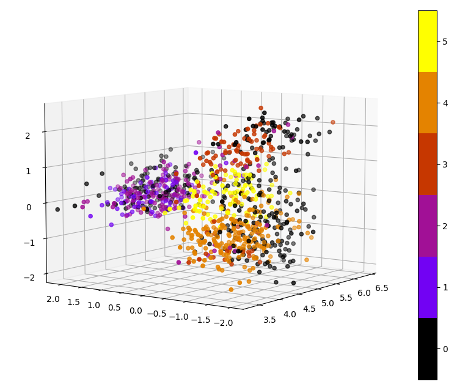

# look_around

A python module for rating text content based on a machine learning model.

## Scope

This module rates how interesting a text is for you, from zero to five starts, once you have trained an AI model. The main assumption is that your rating of a text purely raises from the appearance and the non-appearance of certain words in the document. The exact order words might not play a role. This ansatz migth be true for short texts that intend to point out certain aspects, maybe like recipies (chocolate and raisins are tasty but garlic and salmon in a cake recipy might be not) or job postings.

look_around helps you managing the data that comes with the task. The module keeps track of the sample files and theit meta data. Such meta data might be language, if it is used as a sample fot training or the actual rating.

The same way you can store, organize and use different models. The module also lists them together with their tarining and validation scores. _(OK, this hasn't been implemented yet, but surely you can use this feature in the future soon)_

The module look_around also prepares the raw text files. For now, these documents need to be html files. look_around strips away the html from the texts, removes the stopwords using [nltk](https://www.nltk.org/), and stems the remaining words with the [snowballstemmer](https://pypi.org/project/snowballstemmer/). From the prepared texts a vocabulary is generated using the [scikit-learn TfidfVectorizer](https://scikit-learn.org/stable/modules/generated/sklearn.feature_extraction.text.TfidfVectorizer.html). Words that appear in all documents or that correlate very strongly in their appearances with other words can optionally be dropped from the vocabulary.

## Usage

The data can be easily accessed, processed and manipulated directly from the python console. For this purpose, a lot of convenience methods are provided by an instance of the class look_around.core.look_around.LookAround. In Future, there might be an even more user friendly CLI tool and a GUI tool.

For testing models, a test project can be created by a single command. In this test project, a whole bunch of fictional job postings are generated from a, very simple, grammar and labeled algorithmically.

The fictional, randomly generated documents from a test project, after a singular value decomposition with three components. The colors represent the ratings. The clusters overlap a bit. Nevertheless, are distinctive clouds of five star, four star, three star and less than three star rated texts. Otherwise well rated texts that were labeled zero in the test project due to hitting a out criteria are scattered in specific parts of the well-rated-documents region.